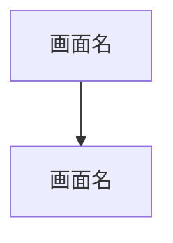

# 要件定義書テンプレート

以下のテンプレートに沿って要件定義書を出力する。各セクションの内容はヒアリングで得た情報に基づいて埋める。

**構成要素に応じたセクション適用ルール:**
- プロジェクトは複数の構成要素（UI / API / バッチ等）を持てる。該当する構成要素のセクション・項目のみ含め、該当しないものは丸ごと省略する。
- セクション4（画面構成）→ UIを含む場合のみ
- 機能詳細のインターフェース定義 → 構成要素に応じたブロックのみ記載
- 技術スタック未定 → セクション6.1は「未定」と明記

---

```markdown
# {プロジェクト名} 要件定義書

## 1. プロジェクト概要

### 1.1 背景
- プロジェクトが必要になった経緯・課題

### 1.2 目的
- プロジェクトで達成したいこと
- 解決する課題

### 1.3 スコープ
- 本プロジェクトで対応する範囲
- 対応しない範囲（スコープ外の明示）

### 1.4 構成要素
プロジェクトが含む構成要素にチェック（複数可）:
- [ ] Web UI
- [ ] API
- [ ] バッチ処理
- [ ] 業務自動化
- [ ] その他: {内容}

---

## 2. ターゲット

### 2.1 利用主体
各利用主体について以下を記載:
- 利用主体名（ユーザー / 外部システム / スケジューラ等）
- 種別（人間 / システム / タイマー）
- 説明・特徴
- 主な利用シーン

### 2.2 要求仕様一覧

#### 人間ユーザー向け（ユーザーストーリー形式）
| ID | ユーザー種別 | ストーリー | 受け入れ条件 | 優先度 |
|----|------------|-----------|------------|--------|
| US-001 | {種別} | {種別}として、{目的}のために、{行動}したい | - {条件1}<br>- {条件2} | Must/Should/Could |

#### システム連携・バッチ・業務自動化向け（システム要求形式）
| ID | トリガー | 処理概要 | 成功条件 | 異常時の振る舞い | 優先度 |
|----|---------|---------|---------|----------------|--------|
| SR-001 | {APIコール / cron / イベント等} | {処理内容} | - {条件1}<br>- {条件2} | {リトライ / アラート等} | Must/Should/Could |

---

## 3. 機能要件

### 3.1 機能一覧と優先度
| ID | 機能名 | 概要 | 構成要素 | 優先度 | 関連ID | 詳細度 |
|----|--------|------|---------|--------|--------|--------|
| F-001 | {機能名} | {概要} | UI, API | Must | US-001 | 詳細 |
| F-002 | {機能名} | {概要} | バッチ | Must | SR-001 | 詳細 |
| F-003 | {機能名} | {概要} | API | Should | SR-002 | 概要のみ |

※ Must機能は詳細定義、Should/Could機能は概要レベルの記載とする。

### 3.2 機能詳細（Must機能）

#### F-001: {機能名}

**概要**: {機能の説明}

**関連要求仕様**: US-XXX / SR-XXX

**入力項目**:
| 項目名 | 型 | 必須 | バリデーション | 備考 |
|--------|-----|------|--------------|------|
| {項目} | {型} | Yes/No | {ルール} | {備考} |

**出力項目**:
| 項目名 | 型 | 条件 | 備考 |
|--------|-----|------|------|
| {項目} | {型} | {条件} | {備考} |

**処理フロー**:
1. {ステップ1}
2. {ステップ2}
3. ...

**バリデーションルール**:
| ルールID | 対象項目 | ルール | エラー時の振る舞い |
|---------|---------|--------|-----------------|
| V-001 | {項目} | {ルール} | {エラーメッセージ・動作} |

**エラーハンドリング**:
| エラー条件 | エラーメッセージ | 振る舞い |
|-----------|----------------|---------|
| {条件} | {メッセージ} | {動作} |

**データ永続化**:
- 対象: {保存するデータ}
- 保持期間: {期間}

<!-- 以下、構成要素に応じて該当するブロックのみ記載 -->

**画面要件**（UIを含む機能の場合）:
- レイアウト: {レイアウトの説明}
- 主要UI要素: {ボタン、フォーム、テーブル等}
- インタラクション: {クリック時、ホバー時等の動作}

**APIインターフェース**（APIを含む機能の場合）:
- エンドポイント: {メソッド} {パス}
- リクエスト形式: {JSON等}
- レスポンス形式: {JSON等}
- 認証: {方式}
- レート制限: {制限値}

**バッチ処理定義**（バッチを含む機能の場合）:
- 実行トリガー: {cron式 / イベント等}
- 入力ソース: {DB / ファイル / API等}
- 出力先: {DB / ファイル / 通知等}
- リトライ: {回数、間隔、条件}
- 冪等性: {担保方法}

**業務自動化定義**（業務自動化を含む機能の場合）:
- 対象システム: {RPA対象アプリ / SaaS名等}
- 操作手順:
  1. {ステップ1}
  2. {ステップ2}
- 前提条件: {ログイン状態、データの事前準備等}
- 失敗時の再開方法: {途中再開 / 最初からやり直し}
- 人間の介入ポイント: {承認、確認等が必要な箇所}

### 3.3 機能概要（Should/Could機能）

#### F-003: {機能名}
**概要**: {機能の説明}
**想定される入出力**: {概要レベルの記述}

---

## 4. 画面構成（UIを含む場合のみ）

### 4.1 画面一覧
| ID | 画面名 | 概要 | URL（想定） |
|----|--------|------|------------|
| S-001 | {画面名} | {概要} | {/path} |

### 4.2 画面遷移図


---

## 5. 非機能要件

### 5.1 パフォーマンス

UI / APIを含む場合:
- レスポンスタイム: {目標値}
- スループット: {目標値}
- 同時接続数: {想定値}

バッチ / 業務自動化を含む場合:
- 処理完了期限: {SLA}
- 実行ウィンドウ: {許容される実行時間帯}
- データ鮮度要件: {どの時点のデータが必要か}
- RTO: {目標復旧時間}
- RPO: {目標復旧地点}

### 5.2 セキュリティ
- 認証方式: {方式}
- 認可モデル: {RBAC等}
- データ保護: {暗号化、マスキング等}
- CORS/CSP等: {ポリシー}

### 5.3 可用性
- 稼働率目標: {SLA}
- 障害時の対応: {フェイルオーバー等}
- バックアップ: {方針}

### 5.4 運用・保守
- ログ: {収集対象、保持期間}
- 監視: {監視項目、アラート条件}
- デプロイ: {方式、頻度}
- CI/CD: {パイプライン構成}

---

## 6. 技術要件

### 6.1 技術スタック
| レイヤー | 技術 | バージョン | 選定理由 |
|---------|------|----------|---------|
| {レイヤー} | {技術} | {ver} | {理由} |

※ プロジェクトの構成要素に該当するレイヤーのみ記載する。未使用レイヤーの行は削除する。
※ 未定の場合は「未定」と記載する。

### 6.2 外部連携
| 連携先 | 方式 | 用途 |
|--------|------|------|
| {サービス名} | {REST API等} | {用途} |

### 6.3 システム構成
{アーキテクチャの説明。Mermaidで図示する。}

---

## 7. 用語集
| 用語 | 定義 |
|------|------|
| {用語} | {定義} |

---

## 8. 未確定事項一覧
| ID | 対象セクション | 内容 | 確認先 | 期限 |
|----|--------------|------|--------|------|
| TBD-001 | {セクション} | {未確定の内容} | {確認先} | {期限} |

※ ヒアリングで確定できなかった項目、推測で補完した箇所をここに集約する。
```
